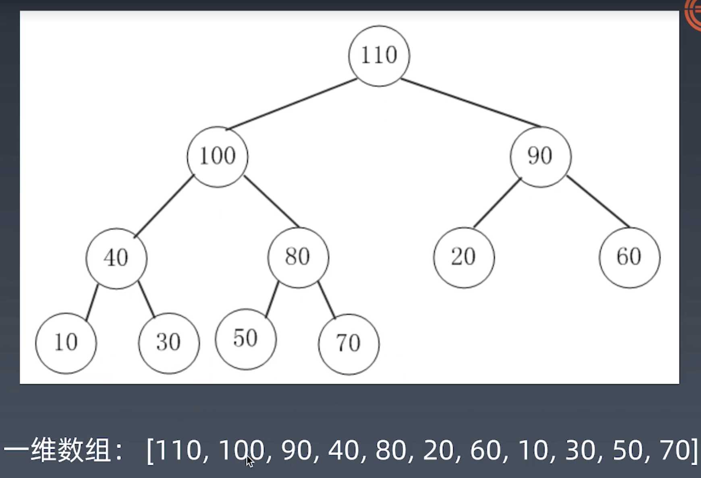

## 递归-前中后序
```python
def preorder (self, root):
	if root:
		self traverse_path append(root val)
		self preorder(root left)
		self preorder(root right)

def inorder (self, root):
	if root:
		self inorder(root left)
		self traverse_path append(root val)
		self inorder(root right)

def postorder (self, root):
	if root:
		self postorder(root left)
		self postorder(root right)
		self traverse_path append(root val)
```

## 堆
wiki: https://zh.wikipedia.org/wiki/%E5%A0%86%E7%A9%8D
是一种可以迅速找到一堆数中最大或最小数的树状结构，满足以下特性：
大顶堆：每个节点都大于其子节点
小顶堆：每个节点都小于其子节点

假设是大顶堆，常见操作有：
find-max: O(1)
delete-max: O(logN)
insert(create): O(logN) or O(1)

二叉堆是堆的一种实现方式，常见的实现方式还有斐波拉契堆等

二叉堆的实现有 2 个特点：
1. 是一棵完全二叉树，除了叶子节点以外都是丰满的
2. 任意节点都小于或大于它的所有子节点，小于就是小顶堆，大于就是大顶堆

二叉堆的实现：
1. 一般通过“数组”实现
2. 假设“第一个元素”在数组中索引为 0 的话，则父节点和子节点的位置关系如下：
	1. 索引为 i 的节点的左孩子的索引是 (2*i+1)
	2. 索引为 i 的节点的右孩子的索引是 (2*i+2)
	3. 索引为 i 的父节点的索引是floor((i-1)/2)
	4. 备注：因为完全二叉树当前层的叶子数量，总是上一层的 2 倍
图例：


insert 实现：
1. 将元素先加入末尾
2. 像该元素的父元素找上去，如果父元素比自己小，那么交换，直到父元素比自己大，或者到了根，则结束

delete-max 实现：
1. 用尾元素将根元素替换掉，堆size -1
2. 将替换上去的元素向下比较，如果max(左孩子, 右孩子) 大于该元素，则与大的元素进行交换，直到左孩子和右孩子都小于该元素，则结束

Java 代码实现：[堆的实现](https://shimo.im/docs/Lw86vJzOGOMpWZz2/read)

