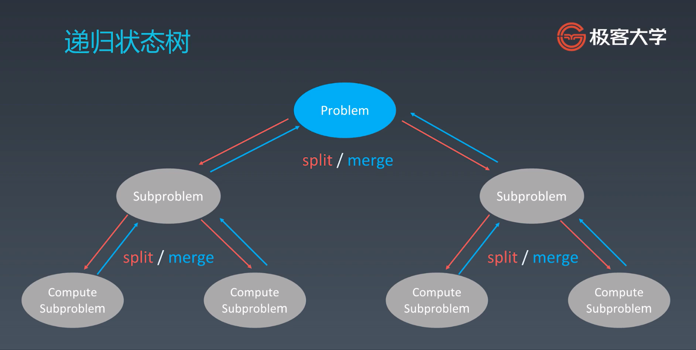

# 递归的总结

## 前中后序代码
```python
def preorder (self, root):
	if root:
		self traverse_path append(root val)
		self preorder(root left)
		self preorder(root right)

def inorder (self, root):
	if root:
		self inorder(root left)
		self traverse_path append(root val)
		self inorder(root right)

def postorder (self, root):
	if root:
		self postorder(root left)
		self postorder(root right)
		self traverse_path append(root val)
```

## 递归写法要素
```js
function recursive(level, param1, param2, ...) {
	// 递归终止条件
	if (level > MAX_LEVEL) {
		return
	}
	// 处理当前层逻辑
	process(level, data)
	// 进入下一层
	recursive(level + 1, param1, param2, ...)
	// clear room
}
```

## 递归的误区：
1. 不要人肉递归
2. 找到最小问题重复性
3. 数学归纳法，证明当第 N 个成立的时候，N+1一个也一定成立，整串爆竹都是成立的

## 分治和回溯
本质上是一种特殊的递归方式
找重复性：最近的重复性，最优的重复性

递归的本质就是找到重复性以及分解问题和最后组合每个子问题的结果


动态规划：提前计算好结果
分治：分解子问题，降低时间复杂度
回溯：尽可能的尝试多的可能性，尽可能的提前终止错误的尝试，回到正确的尝试上来

最小重复性从例子上来说就是把一个问题变成 n - 1，或者 (n - 1) + (n - 2) 类似这样的递归过程，这其中就是利用到数学归纳法来证明最小重复性是成立的，那么只要让计算机重复这个过程就可以推导出最终我们要的结果。

