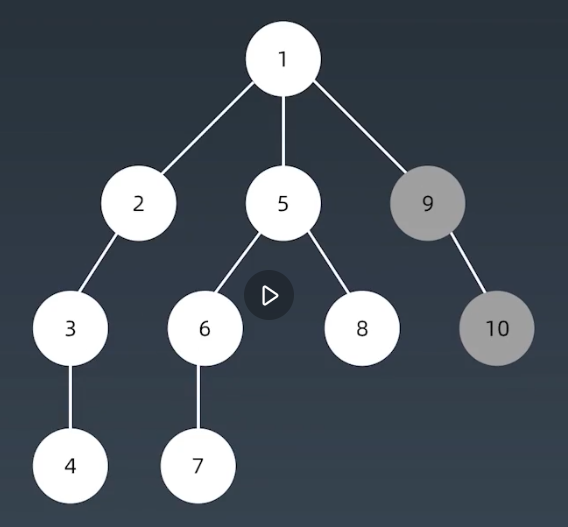
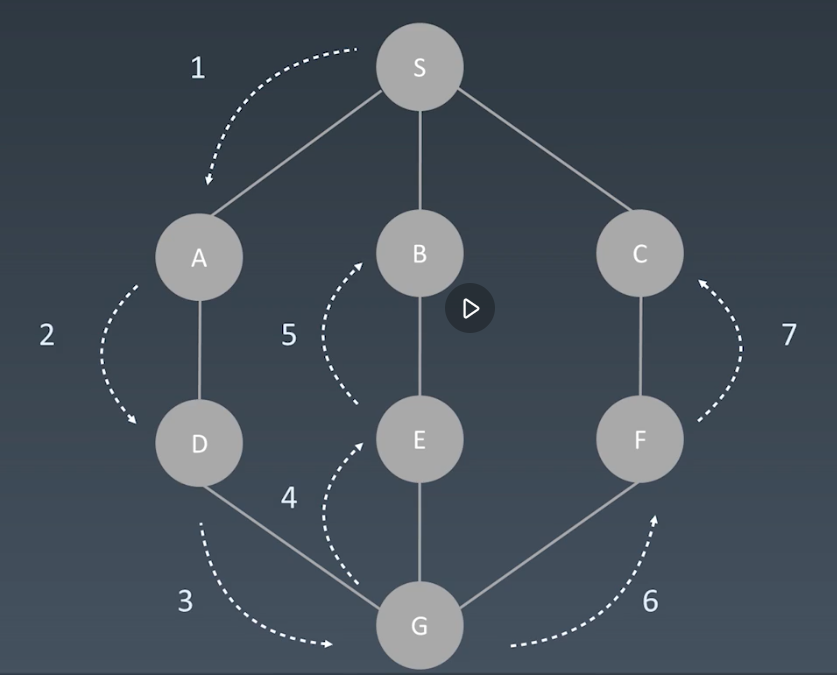
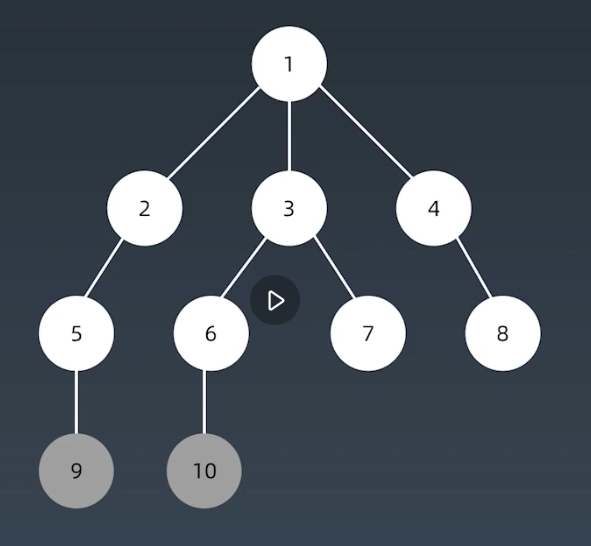
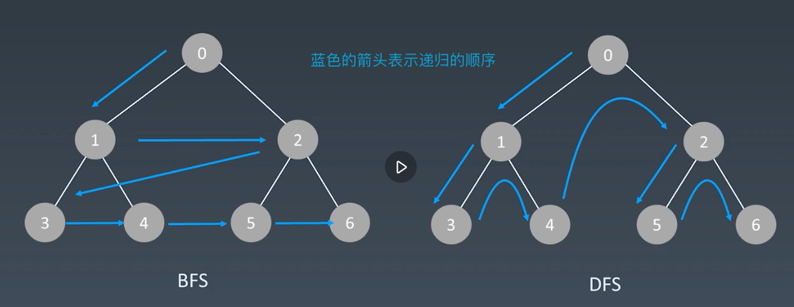

# 搜索
深度优先搜索 deep first search
```python
# 递归写法
visited = set()

def dfs(node, visited):
	visited.add(node)

	# process current node hear
	# ...
	for next_node in node.children():
		if not next_node in visited:
			dfs(next_node, visited)
```
树的递归顺序图

图的递归顺序图


```python
# 非递归写法
def defs(self, tree):
	if tree.root is None:
		return []
	
	visited, stack = [], [tree.root]
	while stack:
		node = stack.pop
		visited.add(node)
		process(node)
		nodes = generate_related_nodes(node)
		stack.push(nodes)

	# other processing work
	...
```

广度优先搜索 breadth first search
像是一个水滴滴下去，激起的水波纹，一层一层向下
```python
# 队列写法
def BFS(graph, start, end):
    visited = set()
	queue = [] 
	queue.append([start]) 

	while queue: 
		node = queue.pop(0) 
		visited.add(node)

		process(node) 
		nodes = generate_related_nodes(node) 
		queue.push(nodes)

	# other processing work 
	...
```
树的遍历顺序

BFS 与 DFS 的区别

